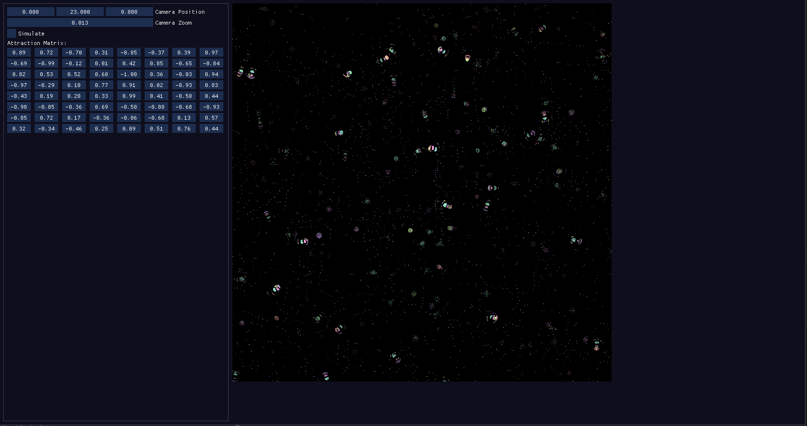

# Particles

Particles is a small particle life/clusters simulation written in C++ and Vulkan for learning purposes.
Clusters is a particle system introduced by [Jeffrey Ventrella](https://www.ventrella.com/Clusters/intro.html).

It can simulate around 32k particles using compute shaders.

## Screenshots

https://github.com/user-attachments/assets/3c4c3e43-497f-49eb-acab-2cdc09c80034

## Dependencies & Setup
All dependencies are handled using vcpkg. CMake is used as a meta buildsystem.

Dependencies:
* fmt
* glm
* imgui
* sdl3
* stb
* vk-bootstrap
* vulkan
* vulkan-memory-allocator

The project adds a custom target for building shaders separately.

## TODO
- [x] Optimizations
- [ ] Window Resize
- [ ] Code Cleanup & Documentation
- [ ] Customizable particle count

## Contributions
This is a private project for learning purporses, so I will not accept any pull requests.
But feel free to fork the project and adapt it to your needs.
